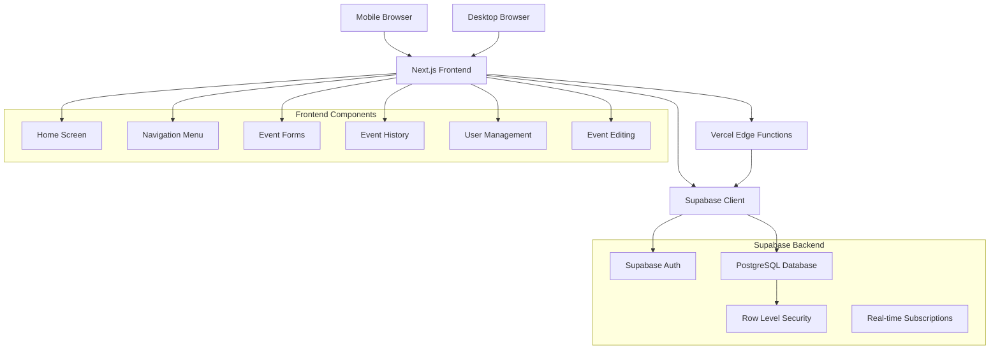
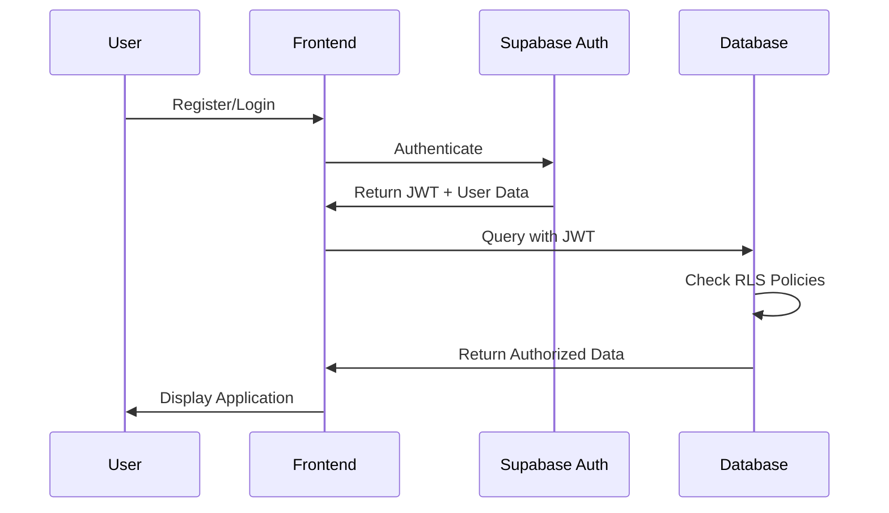

# Design Document: Cat Care Tracker

## Overview

The Cat Care Tracker is a mobile-first web application built with Next.js and Supabase that enables household members to collaboratively track their cat's daily care activities. The system prioritizes feeding logs as the primary feature while providing unified custom event tracking for all other care activities including litter cleaning, vet visits, and behavioral observations.

The application follows a mobile-first design philosophy, optimizing for quick, frequent interactions on smartphones while maintaining full functionality across all modern web browsers. Authentication and authorization are handled through Supabase Auth with Row Level Security (RLS) ensuring household data isolation.

Key features include universal event editing capabilities and time tracking for any event type, providing a comprehensive yet simple care tracking solution.

## Architecture

### Technology Stack

- **Frontend Framework**: Next.js 14+ with App Router
- **Backend**: Supabase (PostgreSQL database, Authentication, Real-time subscriptions)
- **Deployment**: Vercel (seamless Next.js integration)
- **Styling**: Tailwind CSS (mobile-first responsive design)
- **State Management**: React Context + useState/useReducer (lightweight approach)
- **Database ORM**: Supabase JavaScript client (direct PostgreSQL access)

### System Architecture



### Authentication Flow



## Components and Interfaces

### Core Components

#### 1. Authentication System
- **LoginForm**: Handles user authentication via Supabase Auth
- **RegisterForm**: New user registration with pending approval status
- **AuthProvider**: React Context for managing authentication state
- **ProtectedRoute**: HOC for route protection based on user approval status

#### 2. Home Screen (Primary Interface)
- **FeedingStatus**: Displays time since last feeding and daily count
- **QuickFeedButton**: Prominent primary action for logging feedings
- **TimeDisplay**: Real-time updating component showing elapsed time
- **DailyCounter**: Shows current day's feeding count with visual indicators
- **EventTypeGrid**: Shows time since last event for each tracked event type

#### 3. Navigation System
- **MobileNavigation**: Hamburger menu optimized for touch interaction
- **NavigationMenu**: Slide-out menu for accessing secondary features
- **TabBar**: Bottom navigation for quick access on mobile devices

#### 4. Event Management Components
- **UniversalEventForm**: Single form handling both feeding and custom events
- **EventTypeSelector**: Dropdown with predefined and custom event types
- **EditEventModal**: Universal modal for editing any event type
- **EventHistory**: Chronological display of all recorded events with edit options
- **QuickActions**: Fast-access buttons for common event types (litter, vet, etc.)

#### 5. Time Tracking Components
- **TimeTracker**: Displays time since last event for any type
- **EventTypeCard**: Shows event type with last occurrence time
- **TimeGrid**: Dashboard view of all event types and their timestamps

#### 6. User Management (Admin)
- **UserApproval**: Interface for administrators to approve/reject users
- **UserList**: Display of all household members and their status
- **RoleManagement**: Assignment and modification of user roles

### API Interfaces

#### Supabase Database Schema

```sql
-- Users table (extends Supabase auth.users)
CREATE TABLE profiles (
  id UUID REFERENCES auth.users(id) PRIMARY KEY,
  email TEXT NOT NULL,
  full_name TEXT,
  role TEXT DEFAULT 'pending' CHECK (role IN ('admin', 'user', 'pending')),
  household_id UUID NOT NULL,
  created_at TIMESTAMP WITH TIME ZONE DEFAULT NOW(),
  updated_at TIMESTAMP WITH TIME ZONE DEFAULT NOW()
);

-- Households table for data isolation
CREATE TABLE households (
  id UUID DEFAULT gen_random_uuid() PRIMARY KEY,
  name TEXT NOT NULL,
  created_at TIMESTAMP WITH TIME ZONE DEFAULT NOW()
);

-- Feeding events table
CREATE TABLE feeding_events (
  id UUID DEFAULT gen_random_uuid() PRIMARY KEY,
  household_id UUID REFERENCES households(id) NOT NULL,
  user_id UUID REFERENCES profiles(id) NOT NULL,
  food_type TEXT NOT NULL,
  fed_by TEXT NOT NULL,
  created_at TIMESTAMP WITH TIME ZONE DEFAULT NOW(),
  updated_at TIMESTAMP WITH TIME ZONE DEFAULT NOW()
);

-- Custom events table (includes litter cleaning and all other care events)
CREATE TABLE custom_events (
  id UUID DEFAULT gen_random_uuid() PRIMARY KEY,
  household_id UUID REFERENCES households(id) NOT NULL,
  user_id UUID REFERENCES profiles(id) NOT NULL,
  event_type TEXT NOT NULL,
  performed_by TEXT NOT NULL,
  notes TEXT,
  created_at TIMESTAMP WITH TIME ZONE DEFAULT NOW(),
  updated_at TIMESTAMP WITH TIME ZONE DEFAULT NOW()
);

-- Predefined event types for consistency
CREATE TABLE event_types (
  id UUID DEFAULT gen_random_uuid() PRIMARY KEY,
  name TEXT NOT NULL UNIQUE,
  description TEXT,
  is_system_defined BOOLEAN DEFAULT FALSE
);

-- Insert predefined event types
INSERT INTO event_types (name, description, is_system_defined) VALUES
  ('Litter Cleaning', 'Litter box cleaning and maintenance', TRUE),
  ('Vet Visit', 'Veterinary appointments and checkups', TRUE),
  ('Medication', 'Medicine administration', TRUE),
  ('Grooming', 'Brushing, bathing, nail trimming', TRUE),
  ('Behavioral Note', 'Unusual behavior observations', TRUE);
```

#### Row Level Security Policies

```sql
-- Profiles RLS
ALTER TABLE profiles ENABLE ROW LEVEL SECURITY;
CREATE POLICY "Users can view household members" ON profiles
  FOR SELECT USING (household_id = (
    SELECT household_id FROM profiles WHERE id = auth.uid()
  ));

-- Feeding events RLS
ALTER TABLE feeding_events ENABLE ROW LEVEL SECURITY;
CREATE POLICY "Users can manage household feeding events" ON feeding_events
  FOR ALL USING (household_id = (
    SELECT household_id FROM profiles WHERE id = auth.uid()
  ));

-- Custom events RLS
ALTER TABLE custom_events ENABLE ROW LEVEL SECURITY;
CREATE POLICY "Users can manage household custom events" ON custom_events
  FOR ALL USING (household_id = (
    SELECT household_id FROM profiles WHERE id = auth.uid()
  ));
```

### Frontend API Layer

#### Event Service
```typescript
interface EventService {
  // Feeding operations
  createFeedingEvent(data: FeedingEventData): Promise<FeedingEvent>
  updateFeedingEvent(id: string, data: Partial<FeedingEventData>): Promise<FeedingEvent>
  getLatestFeeding(): Promise<FeedingEvent | null>
  getDailyFeedingCount(date: Date): Promise<number>
  
  // Custom events operations
  createCustomEvent(data: CustomEventData): Promise<CustomEvent>
  updateCustomEvent(id: string, data: Partial<CustomEventData>): Promise<CustomEvent>
  getLatestEventByType(eventType: string): Promise<CustomEvent | null>
  
  // Universal operations
  getEventHistory(limit?: number): Promise<(FeedingEvent | CustomEvent)[]>
  getTimeSinceLastByType(eventType: string): Promise<number | null>
  deleteEvent(id: string, eventType: 'feeding' | 'custom'): Promise<void>
}
```

#### User Management Service
```typescript
interface UserService {
  // Authentication
  signUp(email: string, password: string, fullName: string): Promise<AuthResult>
  signIn(email: string, password: string): Promise<AuthResult>
  signOut(): Promise<void>
  
  // User management (admin only)
  getPendingUsers(): Promise<User[]>
  approveUser(userId: string): Promise<void>
  rejectUser(userId: string): Promise<void>
}
```

## Data Models

### Core Entities

#### User Profile
```typescript
interface Profile {
  id: string
  email: string
  fullName: string
  role: 'admin' | 'user' | 'pending'
  householdId: string
  createdAt: Date
  updatedAt: Date
}
```

#### Feeding Event
```typescript
interface FeedingEvent {
  id: string
  householdId: string
  userId: string
  foodType: string
  fedBy: string
  createdAt: Date
  updatedAt: Date
}
```

#### Custom Event
```typescript
interface CustomEvent {
  id: string
  householdId: string
  userId: string
  eventType: string
  performedBy: string
  notes?: string
  createdAt: Date
  updatedAt: Date
}
```

#### Event Type
```typescript
interface EventType {
  id: string
  name: string
  description?: string
  isSystemDefined: boolean
}
```

### State Management

#### Authentication Context
```typescript
interface AuthContextType {
  user: Profile | null
  loading: boolean
  signIn: (email: string, password: string) => Promise<void>
  signUp: (email: string, password: string, fullName: string) => Promise<void>
  signOut: () => Promise<void>
}
```

#### Events Context
```typescript
interface EventsContextType {
  latestFeeding: FeedingEvent | null
  dailyFeedingCount: number
  eventTypeTimestamps: Record<string, Date | null>
  recentEvents: (FeedingEvent | CustomEvent)[]
  refreshEvents: () => Promise<void>
  updateEvent: (id: string, data: any, type: 'feeding' | 'custom') => Promise<void>
}
```

## Mobile-First Responsive Design

### Breakpoint Strategy
```css
/* Mobile-first approach */
/* Base styles: 320px - 767px (mobile) */
.container {
  padding: 1rem;
  max-width: 100%;
}

/* Tablet: 768px - 1023px */
@media (min-width: 768px) {
  .container {
    padding: 2rem;
    max-width: 768px;
    margin: 0 auto;
  }
}

/* Desktop: 1024px+ */
@media (min-width: 1024px) {
  .container {
    max-width: 1024px;
    padding: 3rem;
  }
}
```

### Touch-Optimized Interface
- **Minimum touch target size**: 44px × 44px (iOS guidelines)
- **Primary action button**: Prominent, easily reachable with thumb
- **Gesture support**: Swipe navigation for secondary features
- **Loading states**: Immediate feedback for all user actions

### Performance Optimization
- **Code splitting**: Route-based splitting with Next.js dynamic imports
- **Image optimization**: Next.js Image component with responsive sizing
- **Caching strategy**: SWR for data fetching with background revalidation
- **Bundle size**: Tree shaking and minimal dependencies
## Correctness Properties

*A property is a characteristic or behavior that should hold true across all valid executions of a system-essentially, a formal statement about what the system should do. Properties serve as the bridge between human-readable specifications and machine-verifiable correctness guarantees.*

### Property Reflection

After reviewing the prework analysis, I identified several areas where properties can be consolidated:

- **Event Creation Properties**: Multiple properties about timestamp capture, validation, and persistence can be combined into comprehensive properties that work across all event types
- **Time Calculation Properties**: Properties about time display and formatting can be unified
- **Data Persistence Properties**: Similar persistence requirements across different event types can be consolidated
- **User Attribution Properties**: Properties about recording user identity can be combined

### Converting EARS to Properties

Based on the prework analysis, here are the key correctness properties:

**Property 1: Event Timestamp Consistency**
*For any* event (feeding or custom), when created, the timestamp should be within 5 seconds of the current system time
**Validates: Requirements 1.1, 4.1**

**Property 2: Event Validation Completeness**
*For any* event creation attempt with missing required fields, the system should reject the submission and return specific validation errors for each missing field
**Validates: Requirements 1.5, 4.6**

**Property 3: Event Persistence Guarantee**
*For any* valid event, after successful creation, querying the database immediately should return the same event data
**Validates: Requirements 1.4, 4.5**

**Property 4: Event Editing Preservation**
*For any* event modification, all unchanged fields should remain identical while only specified fields are updated, and the updated_at timestamp should be newer than created_at
**Validates: Requirements 3.3, 3.4**

**Property 5: Time Calculation Accuracy**
*For any* event type with recorded events, the calculated time since last event should equal the difference between current time and the most recent event timestamp of that type
**Validates: Requirements 2.1, 5.1**

**Property 6: Daily Count Accuracy**
*For any* given date, the daily feeding count should equal the number of feeding events recorded on that calendar day
**Validates: Requirements 2.2**

**Property 7: Time Formatting Consistency**
*For any* duration calculation, the formatted output should display hours and minutes in a consistent "Xh Ym" format
**Validates: Requirements 2.5, 5.4**

**Property 8: User Attribution Integrity**
*For any* event created by an authenticated user, the event record should contain the correct user ID and the user should be able to retrieve that event
**Validates: Requirements 11.2, 11.3**

**Property 9: Household Data Isolation**
*For any* user query, the returned events should only include records from that user's household and exclude all events from other households
**Validates: Requirements 13.2, 13.3**

**Property 10: Role-Based Access Control**
*For any* user with admin role, they should have access to user management functions, while users with regular role should be denied access to these functions
**Validates: Requirements 12.1, 12.5**

**Property 11: Authentication State Consistency**
*For any* user authentication attempt, valid credentials should result in successful login with proper user data, while invalid credentials should be rejected with appropriate error messages
**Validates: Requirements 10.3, 10.5**

**Property 12: Event Type Time Tracking Independence**
*For any* event type, the time since last occurrence should be calculated independently from other event types and reflect only the most recent event of that specific type
**Validates: Requirements 5.1, 5.2**

**Property 13: Cross-User Event Aggregation**
*For any* household, time calculations and event displays should include events from all approved household members, regardless of who created each event
**Validates: Requirements 5.2, 11.4**

**Property 14: Event Editing Validation**
*For any* event edit attempt with invalid data, the system should reject the changes and preserve the original event data unchanged
**Validates: Requirements 3.5**

**Property 15: Database Storage Consistency**
*For any* event creation or modification, the data stored in the Supabase PostgreSQL database should exactly match the data submitted by the user
**Validates: Requirements 8.1**

## Error Handling

### Client-Side Error Handling
- **Network Errors**: Retry mechanisms with exponential backoff
- **Validation Errors**: Real-time form validation with clear error messages
- **Authentication Errors**: Automatic token refresh and re-authentication prompts
- **Offline Handling**: Queue operations for when connectivity returns

### Server-Side Error Handling
- **Database Constraints**: Proper error mapping to user-friendly messages
- **RLS Violations**: Security error handling without information leakage
- **Rate Limiting**: Graceful degradation under high load
- **Data Integrity**: Transaction rollbacks for failed operations

### Event Editing Error Scenarios
- **Concurrent Edits**: Handle multiple users editing the same event
- **Timestamp Conflicts**: Validate edited timestamps are reasonable
- **Permission Errors**: Ensure users can only edit events they have access to
- **Data Corruption**: Rollback failed edits to preserve data integrity

## Testing Strategy

### Dual Testing Approach
The system will use both unit testing and property-based testing for comprehensive coverage:

- **Unit Tests**: Verify specific examples, edge cases, and error conditions
- **Property Tests**: Verify universal properties across all inputs using generated test data

### Property-Based Testing Configuration
- **Testing Library**: fast-check for JavaScript/TypeScript property-based testing
- **Test Iterations**: Minimum 100 iterations per property test
- **Test Tagging**: Each property test tagged with format: **Feature: cat-care-tracker, Property {number}: {property_text}**

### Unit Testing Focus Areas
- **Authentication flows**: Login, registration, approval workflows
- **Event creation forms**: Validation, submission, error handling
- **Event editing workflows**: Modification, validation, persistence
- **Time calculations**: Edge cases like timezone changes, daylight saving
- **Mobile responsiveness**: Touch interactions, viewport adaptations
- **Database operations**: CRUD operations, RLS policy enforcement

### Integration Testing
- **End-to-end user flows**: Complete user journeys from registration to event logging and editing
- **Cross-browser compatibility**: Testing across Chrome, Firefox, Safari, Edge
- **Mobile device testing**: Real device testing on iOS and Android
- **Performance testing**: Load testing with multiple concurrent users
- **Multi-user scenarios**: Testing household data sharing and isolation

### Testing Environment Setup
- **Test Database**: Isolated Supabase project for testing
- **Mock Services**: Mocked external dependencies for unit tests
- **Test Data**: Automated test data generation and cleanup
- **CI/CD Integration**: Automated testing on every commit and deployment

### Event Management Testing Priorities
- **Event CRUD Operations**: Create, read, update, delete for all event types
- **Time Tracking Accuracy**: Verify time calculations across different event types
- **Data Isolation**: Ensure household data separation
- **Concurrent Access**: Multiple users accessing and modifying shared data
- **Mobile Interaction**: Touch-optimized interface testing